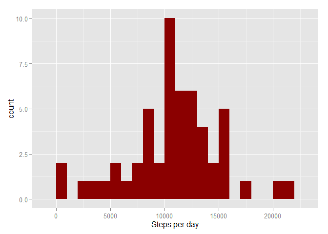
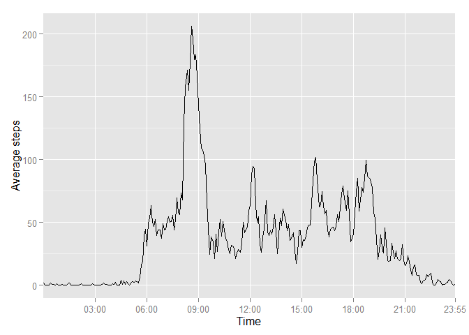
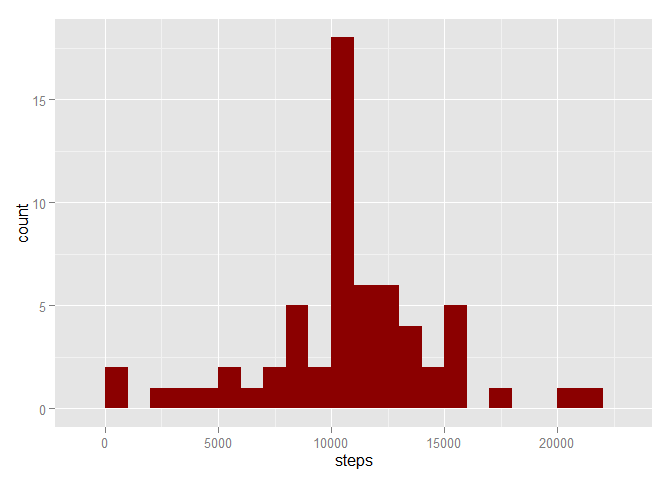
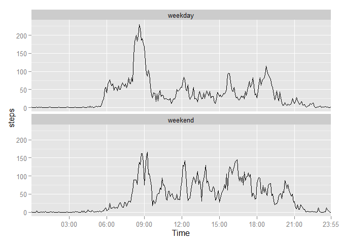

# Reproducible Research: Peer Assessment 1

Load ggplot2


```r
library(ggplot2)
```

```
## Warning: package 'ggplot2' was built under R version 3.1.3
```

## Loading and preprocessing the data

Read the data


```r
activityData<-read.csv("C:/Users/jgregory/Documents/RepData_PeerAssessment1-master/activity/activity.csv")
```

Convert date into a date Class


```r
activityData$date <- as.Date(activityData$date, "%Y-%m-%d")
```

## What is mean total number of steps taken per day?

Look at a histogram of the total number of steps taken each day


```r
stepsperdayData <- aggregate(steps~date, data = activityData, FUN = sum)

g<- ggplot(data = stepsperdayData, aes(x = steps))
g<- g+ geom_histogram(fill = "dark red",binwidth = 1000) + xlab("Steps per day")
g
```

<!-- -->

Find the mean and median number of steps per day


```r
summary(stepsperdayData$steps)[c(3,4)]
```

```
## Median   Mean 
##  10760  10770
```

## What is the average daily activity pattern?

To emable plotting of a time series, create a vector called minutes to use as an x-axis label

```r
hour <- activityData$interval %/% 100
minute <-activityData$interval %% 100
minutes <- (60*hour) + minute
activityData$minutes <- minutes
```

Plot the time series


```r
timeseriesData <- aggregate(steps ~ interval + minutes, data = activityData, FUN = mean)


g2 <- ggplot(data = timeseriesData, aes(x=minutes, y = steps)) 
g2<-g2 + geom_line(size = 0.6) +ylab("Average steps") + xlab("Time")
g2 <- g2 + scale_x_discrete(breaks = c(3*60,6*60,9*60,12*60,15*60,18*60,21*60,23*60 + 55), labels = c("03:00","06:00","09:00","12:00","15:00","18:00","21:00","23:55"))
g2
```

<!-- -->

FInd the time interval containing the maximum number of steps


```r
timeseriesData[timeseriesData$steps == max(timeseriesData$steps),]$interval
```

```
## [1] 835
```

## Imputing missing values

Calculate and report the total number of missing values in the dataset (i.e. the total number of rows with NAs)


```r
sum(is.na(activityData$steps))
```

```
## [1] 2304
```

Replace the missing values with the average value for the interval


```r
activityData_NAreplace <-activityData


for (i in 1: length(activityData$steps)) {
        
        if (is.na(activityData[i,1])) {
                
                activityData_NAreplace[i,1] <- timeseriesData[timeseriesData$interval == activityData[i,3],3]
        }
        
        
}
```

Histogram of the total number of steps taken each day when missing values are filled in


```r
stepsperday_NAreplace <- aggregate(steps~date,data = activityData_NAreplace,FUN = sum)


g3<- ggplot(data = stepsperday_NAreplace, aes(x = steps), FUN = sum) 
g3<-g3 +geom_histogram(fill = "dark red", binwidth = 1000)
g3
```

<!-- -->

Report the mean and median total number of steps taken per day when the missing values are filled in


```r
summary(stepsperday_NAreplace$steps)[c(3,4)]
```

```
## Median   Mean 
##  10770  10770
```

Write some stuff here

## Are there differences in activity patterns between weekdays and weekends?

Create a new factor variable in the dataset with two levels - "weekday" and "weekend" indicating whether a given date is a weekday or weekend day.


```r
DaysactivityData_NArelplace <- activityData_NAreplace
DaysactivityData_NArelplace$date <- weekdays(DaysactivityData_NArelplace$date, FALSE)
DaysactivityData_NArelplace$date <- as.factor(DaysactivityData_NArelplace$date)
levels(DaysactivityData_NArelplace$date) <- c(rep("weekday",2),rep("weekend",2),rep("weekday",3))
```

Create a panel plot of the average number of steps taken per five minute interval faceted by day type (weekend or weekday)


```r
WeekendData <- aggregate(steps ~ date + minutes ,DaysactivityData_NArelplace, FUN = mean)

g4 <- ggplot(data = WeekendData, aes(x = minutes, y = steps)) + geom_line() + facet_wrap(~date, nrow = 2)
g4 <- g4 + scale_x_discrete(breaks = c(3*60,6*60,9*60,12*60,15*60,18*60,21*60,23*60 + 55),
                             labels = c("03:00","06:00","09:00","12:00","15:00","18:00","21:00","23:55"))
g4<-g4 + xlab("Time")
g4
```

<!-- -->
